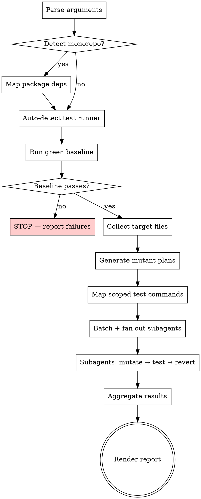

# Mutation Testing Skill Implementation Plan

> **For agentic workers:** REQUIRED SUB-SKILL: Use superpowers:subagent-driven-development (recommended) or superpowers:executing-plans to implement this plan task-by-task. Steps use checkbox (`- [ ]`) syntax for tracking.

**Goal:** Create a Claude Code skill (`/run-mutation-tests`) that performs mutation testing on JS/TS codebases by having Claude act as the mutation engine.

**Architecture:** Single `SKILL.md` file containing all instructions for Claude to follow when invoked. The skill guides Claude through monorepo detection, green baseline verification, mutant generation (70% classical / 30% semantic), parallel execution via subagents with scoped test commands, and terminal report rendering.

**Tech Stack:** Claude Code skill (markdown), Git, npm/yarn/pnpm test runners

**Spec:** `docs/superpowers/specs/2026-03-30-mutation-testing-design.md`

---

### Task 1: RED — Baseline test without skill

**Goal:** Establish what Claude does when asked to perform mutation testing WITHOUT the skill present. Document rationalizations and failures.

**Files:**
- None (observation only)

- [ ] **Step 1: Run baseline scenario — simple project**

Dispatch a subagent with this prompt (no skill loaded):

```
You are working in a JS/TS project. The user wants you to perform mutation testing on the file `src/utils/math.ts`. This means: introduce small code changes (mutants) one at a time, run the tests after each change, and report which mutants survived (tests still passed) vs which were killed (tests failed). Do this now.
```

Observe and document:
- Does it understand mutation testing at all?
- Does it apply mutations one at a time and revert?
- Does it run tests after each mutation?
- Does it produce a structured report?
- Does it detect the test runner correctly?
- What rationalizations does it use to skip steps?

- [ ] **Step 2: Run baseline scenario — monorepo**

Dispatch a subagent with this prompt:

```
You are working in a monorepo with pnpm workspaces. The user wants you to perform mutation testing on files changed in the current branch vs main. Introduce mutants one at a time, run relevant tests, report survivors. Consider cross-package dependencies.
```

Observe and document:
- Does it detect the monorepo structure?
- Does it scope tests correctly to affected packages?
- Does it handle cross-package dependencies?

- [ ] **Step 3: Run baseline scenario — parallel execution**

Dispatch a subagent with this prompt:

```
You are working in a large JS/TS project with 50+ source files. The user wants mutation testing on the full codebase. This will take too long sequentially. Use subagents to parallelize the work. Each subagent should handle a batch of files, apply mutations, run scoped tests, and return results. Aggregate the results into a final report.
```

Observe and document:
- Does it parallelize at all?
- Does it use scoped test commands or run the full suite?
- Does it aggregate results into a coherent report?

- [ ] **Step 4: Document baseline findings**

Write down:
- Specific rationalizations used (verbatim quotes)
- Steps skipped or done incorrectly
- Report quality issues
- Patterns across scenarios

These findings directly inform what the skill must address.

---

### Task 2: GREEN — Write the SKILL.md

**Goal:** Write the skill addressing the specific failures observed in Task 1.

**Files:**
- Create: `plugins/thdepauw/skills/run-mutation-tests/SKILL.md`

- [ ] **Step 1: Create the skill directory**

```bash
mkdir -p plugins/thdepauw/skills/run-mutation-tests
```

- [ ] **Step 2: Write SKILL.md**

Create `plugins/thdepauw/skills/run-mutation-tests/SKILL.md` with the following structure. The content below is the complete skill — adapt specific wording based on baseline findings from Task 1.

```markdown
---
description: Use when the user wants to run mutation testing, verify test quality, check test coverage effectiveness, or find untested code paths in a JS/TS codebase
user-invocable: true
---

# Mutation Testing

## Overview

Perform mutation testing on JS/TS codebases. You are the mutation engine: read source code, generate mutants, apply them one at a time, run the test suite, record whether each mutant was killed or survived, and produce a terminal report.

**Core principle:** A surviving mutant is a bug your tests can't catch. Kill rate measures real test effectiveness, not line coverage.

## Invocation

Three modes via `$ARGUMENTS`:

| Argument | Behavior |
|---|---|
| `full` (default) | Mutate all JS/TS source files |
| `file <path>` | Mutate only the specified file(s) |
| `diff` | Mutate files changed vs `main` (or `master` if no `main`) |
| `diff <branch>` | Mutate files changed vs the specified branch |

Parse `$ARGUMENTS` to determine mode. If empty or unrecognized, default to `full`.

**Target files:** `.js`, `.ts`, `.jsx`, `.tsx`
**Excluded:** `node_modules`, test files (`*.test.*`, `*.spec.*`, `__tests__/`), config files (`*.config.*`, `.*.js`), type declarations (`.d.ts`), generated files

## Process



## Step 1: Monorepo Detection

Check for workspace configuration:
- `workspaces` field in root `package.json`
- `pnpm-workspace.yaml`, `lerna.json`, `nx.json`, `turbo.json`

If monorepo:
- Identify affected packages (based on mode)
- Read each affected package's `package.json` to map internal dependencies (`dependencies`, `devDependencies`)
- When mutating package A, also run tests in packages that depend on A

## Step 2: Auto-Detect Test Runner

Per package (monorepo) or project-wide (single repo). Priority:
1. `test:ci` or `ci:test` script in `package.json` — preferred, matches CI
2. `test` script in `package.json` — fallback
3. Direct detection of Jest/Vitest/Mocha config files if no script found

Record the base test command for later scoping.

## Step 3: Green Baseline

Run the full test suite using the detected command. In a monorepo, run tests for all affected packages.

**If tests fail:** STOP. Report the failures. Tell the user to fix them before running mutation testing. Do NOT proceed to mutation.

**If tests pass:** Proceed.

## Step 4: Collect Target Files

Based on mode:
- `full`: Glob for all `.js`, `.ts`, `.jsx`, `.tsx` files, excluding test files, `node_modules`, configs, `.d.ts`, generated files
- `file <path>`: Use the specified file(s)
- `diff [branch]`: Run `git diff --name-only <branch>...HEAD` (default branch: `main`, fallback `master`), filter to target extensions

## Step 5: Generate Mutant Plans

For each target file:
1. Read the file
2. Identify all functions/methods
3. Assess each function's complexity:
   - **Simple** (few branches, linear, short): 1-2 mutants
   - **Moderate** (some branching, loops): 3-5 mutants
   - **Complex** (deep nesting, many branches, error handling): 6-10 mutants
4. Generate a mutant plan per function — a list of mutations to apply, using the 70/30 split

**Do NOT modify any files yet.** This step produces plans only.

### Classical Operators (70% of mutants)

| Operator | Transformation |
|---|---|
| Conditional flip | `===` → `!==`, `>` → `<=`, `&&` → `\|\|` |
| Arithmetic swap | `+` → `-`, `*` → `/` |
| Remove return value | `return x` → `return undefined` |
| Delete function call | `logger.warn(msg)` → *(removed)* |
| Negate boolean | `true` → `false`, `!x` → `x` |
| Boundary shift | `x > 0` → `x >= 0`, `i < len` → `i <= len` |
| Empty collection | `return [items]` → `return []` |
| Remove exception | `throw new Error(...)` → *(removed)* |

### Semantic Operators (30% of mutants)

Read the surrounding context and introduce plausible-but-wrong changes a developer might make:

| Operator | Transformation |
|---|---|
| Off-by-one | Adjust loop bounds, array indices, slice args |
| Wrong variable | Swap for similarly-named variable in scope |
| Incorrect default | Change default parameter to plausible wrong value |
| Subtle logic error | Reorder conditions, swap early-return logic |
| Missing null check | Remove a guard clause for null/undefined |

## Step 6: Map Scoped Test Commands

For each source file, determine the test command that tests ONLY that file:
- Map `src/utils/retry.ts` → find `retry.test.ts` or `retry.spec.ts`
- Use test runner scoping flags: Jest `--testPathPattern`, Vitest file path arg, Mocha `--grep`
- In monorepo: also include scoped tests in dependent packages
- If no specific test mapping found, fall back to package-level test suite

**Why scoped:** Running the full suite per mutant is too slow and causes side effects when subagents run in parallel.

## Step 7: Execute Mutations with Subagents

### Batching

- Distribute files across subagents, each getting ~5-10 files
- For small runs (< 5 files): skip subagents, run sequentially in main context
- Max 5 concurrent subagents

### Subagent Instructions

Dispatch each subagent with its batch of files, mutant plans, and scoped test commands. Each subagent MUST follow this loop for every mutant:

1. Apply the mutation using the Edit tool (change one thing)
2. Run the scoped test command
3. Record result:
   - **Killed**: test failed (good — mutation was caught)
   - **Survived**: test passed (bad — tests missed this)
4. Revert the mutation: `git checkout -- <file>`
5. Move to next mutant

**CRITICAL:** Always revert via `git checkout -- <file>` after each mutation. Never leave a mutant in place.

### Subagent return format

Each subagent returns a structured list:

```
file: src/utils/retry.ts
  line: 24 | function: retryOperation | type: BOUNDARY | mutation: `i < max` → `i <= max` | result: SURVIVED
  line: 31 | function: retryOperation | type: SEMANTIC | mutation: removed null check on options.onRetry | result: KILLED
```

## Step 8: Aggregate & Render Report

Collect all subagent results and render the terminal report:

### Summary header

```
Mutation Testing Report
═══════════════════════
Mode: diff (vs main)
Files tested: 12
Total mutants: 47
Killed: 38 (80.9%)
Survived: 9 (19.1%)
Not tested: 0
```

### Surviving mutants

List ONLY the survivors — these are the actionable items:

```
Surviving Mutants
─────────────────
src/utils/retry.ts:24
  Function: retryOperation
  Mutation: [BOUNDARY] changed `i < maxRetries` → `i <= maxRetries`

src/services/auth.ts:55
  Function: validateToken
  Mutation: [CONDITIONAL] flipped `===` → `!==`
```

### Per-file breakdown

```
File Breakdown
──────────────
src/utils/retry.ts        5 mutants   3 killed   2 survived
src/services/auth.ts      8 mutants   7 killed   1 survived
src/services/user.ts      6 mutants   6 killed   0 survived
```

### Score interpretation

- **80%+**: Good test coverage
- **60-80%**: Gaps worth investigating
- **<60%**: Significant test gaps

## Common Mistakes

| Mistake | Fix |
|---|---|
| Forgetting to revert a mutant | ALWAYS `git checkout -- <file>` after each test run |
| Running full test suite per mutant | Use scoped test commands mapped in Step 6 |
| Modifying test files | NEVER mutate test files — only source files |
| Skipping green baseline | ALWAYS verify tests pass before mutating |
| Leaving mutants after subagent failure | Check `git status` and revert any remaining changes |
| Not considering monorepo dependencies | Mutating package A requires testing dependents B, C |
| Running all subagents against full suite | Scoped tests prevent side effects between parallel agents |
```

- [ ] **Step 3: Verify skill file structure**

```bash
# Check file exists and has valid frontmatter
head -5 plugins/thdepauw/skills/run-mutation-tests/SKILL.md

# Check word count (aim for <500 for non-frequently-loaded skill)
wc -w plugins/thdepauw/skills/run-mutation-tests/SKILL.md
```

- [ ] **Step 4: Commit the skill**

```bash
git add plugins/thdepauw/skills/run-mutation-tests/SKILL.md
git commit -m "feat: add run-mutation-tests skill"
```

---

### Task 3: GREEN — Test the skill with scenarios

**Goal:** Verify the skill makes Claude follow the correct mutation testing workflow.

**Files:**
- Modify (if needed): `plugins/thdepauw/skills/run-mutation-tests/SKILL.md`

- [ ] **Step 1: Test scenario — simple single-file project**

Dispatch a subagent WITH the skill loaded. Use a real or sample JS/TS project with a source file and test file. Prompt:

```
/run-mutation-tests file src/utils/math.ts
```

Verify:
- Detects test runner correctly
- Runs green baseline first
- Generates mutant plan without modifying code first
- Applies mutations one at a time
- Runs scoped tests (not full suite)
- Reverts each mutation
- Produces structured report with all three sections

- [ ] **Step 2: Test scenario — diff mode**

Dispatch a subagent WITH the skill in a project with changes on a branch:

```
/run-mutation-tests diff main
```

Verify:
- Correctly computes diff vs main
- Only targets changed files
- Follows full workflow

- [ ] **Step 3: Test scenario — handles failing baseline**

Dispatch a subagent WITH the skill in a project with failing tests:

```
/run-mutation-tests full
```

Verify:
- Runs baseline
- Detects failure
- Stops and reports — does NOT proceed to mutation

- [ ] **Step 4: Test scenario — parallel execution**

Dispatch a subagent WITH the skill in a project with 10+ source files:

```
/run-mutation-tests full
```

Verify:
- Uses subagents for parallel execution
- Uses scoped test commands per file
- Aggregates results from all subagents
- Produces complete report

- [ ] **Step 5: Document test results**

Record which scenarios passed/failed and what needs fixing.

---

### Task 4: REFACTOR — Close loopholes

**Goal:** Fix any issues found in Task 3 testing.

**Files:**
- Modify: `plugins/thdepauw/skills/run-mutation-tests/SKILL.md`

- [ ] **Step 1: Address test failures**

For each failing scenario from Task 3:
- Identify what the skill failed to communicate clearly
- Add or modify the relevant section in `SKILL.md`
- Be specific — address the exact rationalization or mistake observed

- [ ] **Step 2: Re-test fixed scenarios**

Re-run any previously failing scenarios to confirm they now pass.

- [ ] **Step 3: Commit fixes**

```bash
git add plugins/thdepauw/skills/run-mutation-tests/SKILL.md
git commit -m "fix: address mutation testing skill test findings"
```

---

### Task 5: Final validation & deploy

**Goal:** Ensure everything is clean and committed.

**Files:**
- None (validation only)

- [ ] **Step 1: Validate plugin structure**

```bash
claude plugin validate .
```

- [ ] **Step 2: Verify skill appears in plugin**

```bash
claude --plugin-dir . -p "list your available skills that mention mutation"
```

- [ ] **Step 3: Final commit if any changes**

```bash
git status
# If any uncommitted changes:
git add -A
git commit -m "chore: finalize run-mutation-tests skill"
```
