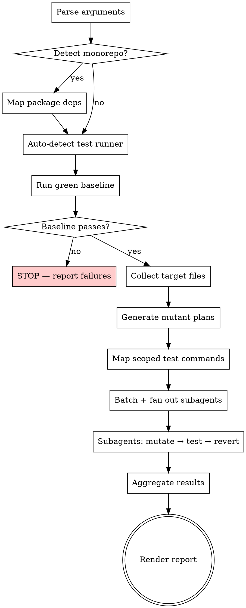

# Mutation Testing

## Overview

Perform mutation testing on JS/TS codebases. You are the mutation engine: read source code, generate mutants, apply them one at a time, run the test suite, record whether each mutant was killed or survived, and produce a terminal report.

**Core principle:** A surviving mutant is a bug your tests can't catch. Kill rate measures real test effectiveness, not line coverage.

**Report only.** Do NOT suggest new tests, do NOT write tests, do NOT offer to fix survivors. The report is the deliverable.

## Invocation

Three modes via `$ARGUMENTS`:

| Argument | Behavior |
|---|---|
| `full` (default) | Mutate all JS/TS source files |
| `file <path>` | Mutate only the specified file(s) |
| `diff` | Mutate files changed vs `main` (or `master` if no `main`) |
| `diff <branch>` | Mutate files changed vs the specified branch |

Parse `$ARGUMENTS` to determine mode. If empty or unrecognized, default to `full`.

**Target files:** `.js`, `.ts`, `.jsx`, `.tsx`
**Excluded:** `node_modules`, test files (`*.test.*`, `*.spec.*`, `__tests__/`), config files (`*.config.*`, `.*.js`), type declarations (`.d.ts`), generated files

## Process



## Step 1: Monorepo Detection

Check for workspace configuration:
- `workspaces` field in root `package.json`
- `pnpm-workspace.yaml`, `lerna.json`, `nx.json`, `turbo.json`

If monorepo:
- Identify affected packages (based on mode)
- Read each affected package's `package.json` to map internal dependencies (`dependencies`, `devDependencies`)
- When mutating package A, also run tests in packages that depend on A

## Step 2: Auto-Detect Test Runner

Per package (monorepo) or project-wide (single repo).

**Priority order (strict — follow this order, do not skip to fallback if a higher-priority option exists):**

1. `test:ci` or `ci:test` script in `package.json` — **preferred, use this first** because it matches CI configuration
2. `test` script in `package.json` — fallback only if no `test:ci`/`ci:test` exists
3. Direct detection of Jest/Vitest/Mocha config files — last resort if no scripts found

Record the base test command for later scoping.

## Step 3: Green Baseline

Run the full test suite using the detected command. In a monorepo, run tests for all affected packages.

**If tests fail:** STOP. Report the failures. Tell the user to fix them before running mutation testing. Do NOT proceed to mutation.

**If tests pass:** Proceed.

## Step 4: Collect Target Files

Based on mode:
- `full`: Glob for all `.js`, `.ts`, `.jsx`, `.tsx` files, excluding test files, `node_modules`, configs, `.d.ts`, generated files
- `file <path>`: Use the specified file(s)
- `diff [branch]`: Run `git diff --name-only <branch>...HEAD` (default branch: `main`, fallback `master`), filter to target extensions

## Step 5: Generate Mutant Plans

For each target file:
1. Read the file
2. Identify all functions/methods
3. Assess each function's complexity and assign a mutant budget:
   - **Simple** (few branches, linear flow, short body): **1-2 mutants**
   - **Moderate** (some branching, loops, moderate length): **3-5 mutants**
   - **Complex** (deep nesting, multiple branches, long body, error handling): **6-10 mutants**
4. Generate a mutant plan per function — a list of mutations to apply, using the **70/30 split**

**Complexity assessment criteria:** Count branch statements (`if`, `else`, `switch`, `case`, ternary `?:`), loop constructs (`for`, `while`, `do`), nesting depth, `try/catch` blocks, and function body length. A function with 0-1 branches and under 10 lines is simple. A function with 2-4 branches or a loop is moderate. A function with 5+ branches, nested loops, or error handling is complex.

**Budget enforcement is mandatory.** Do NOT generate more mutants than the budget allows for a given function. Do NOT skip the complexity assessment and treat all functions equally.

**Do NOT modify any files yet.** This step produces plans only.

### Classical Operators (70% of mutants)

Deterministic, well-known transformations:

| Operator | Transformation |
|---|---|
| Conditional flip | `===` to `!==`, `>` to `<=`, `&&` to `\|\|` |
| Arithmetic swap | `+` to `-`, `*` to `/` |
| Remove return value | `return x` to `return undefined` |
| Delete function call | `logger.warn(msg)` to *(removed)* |
| Negate boolean | `true` to `false`, `!x` to `x` |
| Boundary shift | `x > 0` to `x >= 0`, `i < len` to `i <= len` |
| Empty collection | `return [items]` to `return []`, `return {...}` to `return {}` |
| Remove exception | `throw new Error(...)` to *(removed)* |

### Semantic Operators (30% of mutants)

**You MUST generate semantic mutations, not just classical ones.** Read the surrounding context and introduce plausible-but-wrong changes a real developer might accidentally make:

| Operator | Transformation |
|---|---|
| Off-by-one | Adjust loop bounds, array indices, slice arguments |
| Wrong variable | Swap for a similarly-named variable in scope |
| Incorrect default | Change a default parameter to a plausible but wrong value |
| Subtle logic error | Reorder conditions, swap early-return logic |
| Missing null check | Remove a guard clause that protects against null/undefined |

For semantic mutations, reason about the code's intent and produce mutations that are subtle and realistic — not random noise.

**Enforcing the 70/30 split:** When planning mutants for a file, count the total. Allocate ~70% from the classical table and ~30% from the semantic table. For example, if a file has 10 mutants planned, 7 should be classical and 3 semantic. For small counts (e.g., 2 mutants), at least 1 must be semantic if the function has any viable semantic mutation site.

## Step 6: Map Scoped Test Commands

For each source file, determine the test command that tests ONLY that file:
- Map `src/utils/retry.ts` to find `retry.test.ts` or `retry.spec.ts`
- Use test runner scoping flags: Jest `--testPathPattern`, Vitest file path arg, Mocha `--grep`
- In monorepo: also include scoped tests in dependent packages
- If no specific test mapping found, fall back to package-level test suite

**Why scoped:** Running the full suite per mutant is too slow and causes side effects when subagents run in parallel.

## Step 7: Execute Mutations with Subagents

### Parallelism model: subagents with scoped tests

**Do NOT use git worktrees for parallelism.** Use subagent fan-out where each subagent works in the same working directory but runs only its scoped test commands. Worktrees add unnecessary complexity and file system overhead.

### Batching

- Distribute files across subagents, each getting ~5-10 files
- For small runs (< 5 files): skip subagents, run sequentially in main context
- **Max 5 concurrent subagents** — do not exceed this limit

### Subagent Instructions

Dispatch each subagent with its batch of files, mutant plans, and scoped test commands. Each subagent MUST follow this exact loop for every mutant:

1. Apply the mutation using the Edit tool (change one thing in the source file)
2. Run the scoped test command
3. Record result:
   - **Killed**: test failed (good — mutation was caught)
   - **Survived**: test passed (bad — tests missed this)
4. **Revert the mutation: `git checkout -- <file>`** — use this exact command, not Edit to undo
5. Move to next mutant

**CRITICAL revert rule:** ALWAYS revert via `git checkout -- <file>` after each mutation test cycle. Do NOT use the Edit tool to manually undo changes. Do NOT leave a mutant in place. The `git checkout` command is the only reliable way to restore the exact original file.

### Subagent return format

Each subagent returns a structured list:

```
file: src/utils/retry.ts
  line: 24 | function: retryOperation | type: BOUNDARY | mutation: `i < max` → `i <= max` | result: SURVIVED
  line: 31 | function: retryOperation | type: SEMANTIC | mutation: removed null check on options.onRetry | result: KILLED
```

### Safety

- If a subagent fails or times out, report its files as "not tested" — do not silently drop them
- After all subagents complete, run `git status` to verify no mutations remain. If any files are modified, revert them with `git checkout -- <file>`

## Step 8: Aggregate & Render Report

Collect all subagent results and render the terminal report. Use the EXACT format below — do not invent your own format.

### Section 1: Summary header

```
Mutation Testing Report
═══════════════════════
Mode: diff (vs main)
Files tested: 12
Total mutants: 47
Killed: 38 (80.9%)
Survived: 9 (19.1%)
Not tested: 0
```

### Section 2: Surviving mutants

List ONLY the survivors — these are the actionable items. **Do NOT list killed mutants in this section. Do NOT list killed mutants anywhere in the report.** Killed mutants are a success; they need no attention.

```
Surviving Mutants
─────────────────
src/utils/retry.ts:24
  Function: retryOperation
  Mutation: [BOUNDARY] changed `i < maxRetries` → `i <= maxRetries`

src/services/auth.ts:55
  Function: validateToken
  Mutation: [CONDITIONAL] flipped `===` → `!==`

src/utils/retry.ts:31
  Function: retryOperation
  Mutation: [SEMANTIC] removed null check on `options.onRetry`
```

Each entry shows: file path, line number, function name, mutation category tag (`[CONDITIONAL]`, `[ARITHMETIC]`, `[RETURN]`, `[CALL]`, `[BOOLEAN]`, `[BOUNDARY]`, `[COLLECTION]`, `[EXCEPTION]`, or `[SEMANTIC]`), and a human-readable description.

If zero survivors: print "No surviving mutants. All mutations were caught by the test suite."

### Section 3: Per-file breakdown

```
File Breakdown
──────────────
src/utils/retry.ts        5 mutants   3 killed   2 survived
src/services/auth.ts      8 mutants   7 killed   1 survived
src/services/user.ts      6 mutants   6 killed   0 survived
```

### Score interpretation

Include at the bottom:

```
Score interpretation:
  80%+   Good test coverage
  60-80% Gaps worth investigating
  <60%   Significant test gaps
```

**After the report: STOP.** Do not suggest tests to write. Do not offer to fix survivors. Do not generate test code. The report is the final output.

## Common Mistakes

| Mistake | Fix |
|---|---|
| Forgetting to revert a mutant | ALWAYS `git checkout -- <file>` after each test run — never use Edit to undo |
| Using worktrees for parallelism | Use subagent fan-out with scoped test commands, not worktrees |
| Running full test suite per mutant | Use scoped test commands mapped in Step 6 |
| Modifying test files | NEVER mutate test files — only source files |
| Skipping green baseline | ALWAYS verify tests pass before mutating |
| Leaving mutants after subagent failure | Run `git status` and revert any remaining changes |
| Not considering monorepo dependencies | Mutating package A requires testing dependents B, C |
| Running all subagents against full suite | Scoped tests prevent side effects between parallel agents |
| Using `test` script when `test:ci` exists | Always prefer `test:ci`/`ci:test` over `test` |
| Only generating classical mutations | Enforce the 70/30 split — 30% MUST be semantic/LLM-powered |
| Same number of mutants for every function | Assess complexity: simple=1-2, moderate=3-5, complex=6-10 |
| Listing killed mutants in detail | Only list survivors — killed mutants need no attention |
| Suggesting test improvements | Report only — no test suggestions, no test code generation |
| Inventing a custom report format | Use the exact 3-section format defined in Step 8 |
