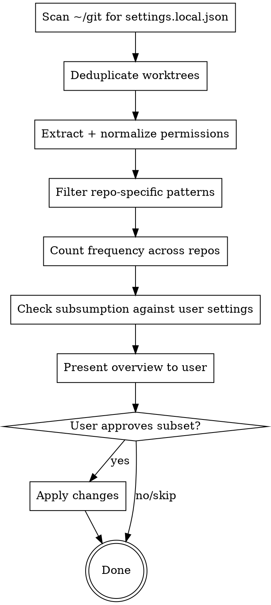

# Sync Claude Permissions

## Overview

Scans project-level `.claude/settings.local.json` files under `~/git`, identifies permission patterns approved across 50%+ of repos, compares against `~/.claude/settings.json`, and proposes additions. Interactive review before any changes.

## Process



## Step-by-Step

### 1. Scan for settings files

```bash
# Find all project-level Claude settings
find ~/git -name "settings.local.json" -path "*/.claude/*" 2>/dev/null
```

### 2. Deduplicate worktrees

Worktrees of the same repo should count as ONE repo, not inflate frequency counts.

**Rule:** If a path contains `.worktrees/`, map it to its parent repo. For example:

- `optios-client-next.worktrees/CLIENT-4418-debt-recover/` → belongs to `optios-client-next`
- Merge all permissions from worktrees into the parent repo's permission set

### 3. Extract and normalize permissions

For each deduplicated repo, collect all `permissions.allow` entries. Then:

**Filter OUT repo-specific patterns:**

- Contains absolute paths (`/Users/`, `/home/`, `/tmp/`)
- Contains `git -C /specific/path` patterns
- Contains project-specific file paths
- One-off approved commands (e.g., a single `git commit -m "..."` approval)

**Keep generic patterns:**

- `Bash(git push)`, `Bash(yarn test:*)`, `Bash(npm run dev:*)`
- `Skill(...)` references
- `mcp__*` tool permissions
- `WebSearch`, `WebFetch(domain:...)`, etc.

### 4. Count frequency and apply threshold

Count how many **deduplicated repos** have each generic pattern. Apply the 50% threshold:

- If 6 out of 11 repos have `Bash(git push)` → qualifies
- If 2 out of 11 repos have `Bash(docker exec:*)` → does not qualify

### 5. Check against user settings (subsumption)

Before suggesting, check if the user-level settings already cover the pattern:

**Direct match:** Pattern exists verbatim in user `permissions.allow` → skip

**Wildcard subsumption:** A broader user pattern already covers the project pattern:

- User has `Bash(yarn build:*)` → project's `Bash(yarn build)` is already covered
- User has `mcp__plugin_atlassian_atlassian__*` → project's `mcp__plugin_atlassian_atlassian__getJiraIssue` is covered

**Important:** `Bash(git push)` (exact) and `Bash(git push:*)` (wildcard) are different permissions. The wildcard covers `Bash(git push --force)` etc., while the exact form only covers `git push` with no args. Treat them as distinct patterns.

**Generalization opportunity:** Multiple project patterns suggest a wildcard:

- Projects have `Bash(git imagetag:*)` across repos → suggest `Bash(git imagetag:*)` even if no single broader pattern exists

### 6. Present overview to user

Show a structured overview with three sections:

**Already covered** (informational):

```
Bash(git push)                    [8/11 repos] ✓ already in user settings
Bash(yarn test:*)                 [6/11 repos] ✓ covered by existing wildcard
```

**Suggested additions** (actionable):

```
Bash(git imagetag:*)              [4/7 repos]  ← NEW
Bash(yarn test:unit:ci:*)         [5/7 repos]  ← NEW
mcp__plugin_sentry_sentry__*      [3/7 repos]  ← NEW
WebSearch                         [4/7 repos]  ← NEW
```

**Below threshold** (FYI, not suggested):

```
Bash(docker exec:*)               [2/7 repos]  below 50%
Bash(kill:*)                      [1/7 repos]  below 50%
```

Ask the user which suggestions to apply using `AskUserQuestion` with multiSelect.

### 7. Apply changes

Read current `~/.claude/settings.json`, add approved patterns to `permissions.allow`, write back. Preserve all other settings (hooks, statusLine, enabledPlugins, etc.).

**Important:** Use `Read` then `Edit` on the settings file — never overwrite the entire file with `Write` since it contains hooks and other config.

## Common Mistakes

| Mistake                                          | Fix                                                                         |
| ------------------------------------------------ | --------------------------------------------------------------------------- |
| Counting worktrees as separate repos             | Deduplicate by mapping worktree paths to parent repo                        |
| Suggesting patterns already covered by wildcards | Check if existing `foo:*` covers `foo:bar`                                  |
| Including absolute-path permissions              | Filter patterns containing `/Users/`, `-C /path`                            |
| Modifying settings without user approval         | Always show overview and ask first                                          |
| Overwriting settings.json entirely               | Use Edit, preserve hooks/plugins/statusLine                                 |
| Counting one-off command approvals               | Filter overly-specific patterns (full commit messages, specific file paths) |
